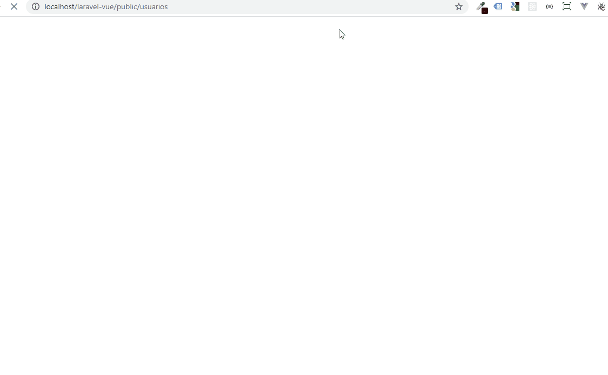

# Laravel com VueJS

Projeto que une os frameworks Laravel e VueJS em seu formato híbrido, onde mostra uma lista de usuários e é possível filtrá-los de diversas formas.

### Pré-requisitos

Ambiente local configurado.

## Iniciando

As instruções abaixo, mostram o passo-a-passo para o funcionamento em uma máquina local.
- Criar o bando de dados e configurar no .env (com nome de exemplo laravel-vue);
- Executar as migrations que vem por padrão no Laravel, com o comando: ````php artisan migrate````;
- Criar a seed de Users com o comando: ````php artisan make:seeder UsersTableSeeder````;
- Executar a seed com o comando: ````php artisan db:seed````;
- Executar o ````npm install```` para instalar as dependências necessárias;


## Funcionando




## Autor

* **Cristian Kozlowski**


## License

Laravel framework é um software de código aberto licenciado pela [MIT license](https://opensource.org/licenses/MIT).
